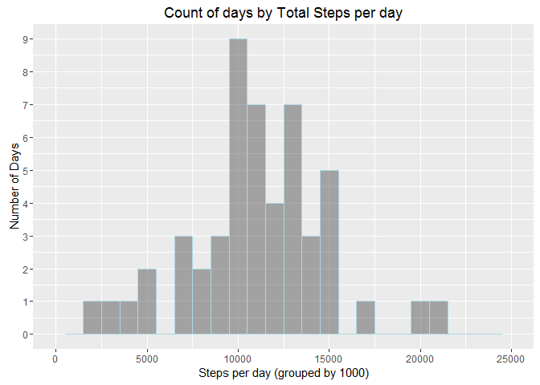
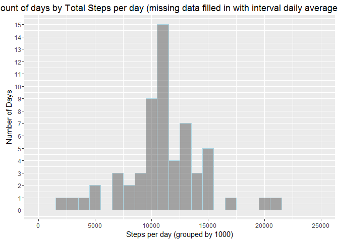
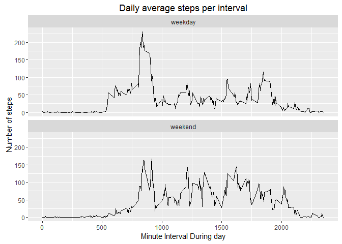

# Reproducible Research: Peer Assessment 1 - Murray Thompson


## Loading and preprocessing the data


```r
#load data (assuming environment with working directory is set to location with source file)
step_data <- read.csv(unzip("activity.zip"))

#load packages (assuming already on system)
library(ggplot2)#for producing plots
library(stats) #for agggregating data
```


----------

## What is mean total number of steps taken per day?


```r
#find the total number of steps taken per day
steps_by_date <- aggregate(steps ~ date, step_data, sum)

#histogram of total steps taken per day
qplot(steps_by_date$steps, 
  geom="histogram", 
  binwidth=1000, 
  xlab="Steps per day (grouped by 1000)", 
  ylab="Number of Days", 
  alpha=I(0.5), 
  col=I("light blue"), 
  xlim=c(0,25000), 
  ylim=c(0,10)) +
  labs(title="Count of days by Total Steps per day") +
  scale_y_continuous(breaks=round(seq(0,10,by=1)))
```

```
## Scale for 'y' is already present. Adding another scale for 'y', which
## will replace the existing scale.
```

<!-- -->

```r
#Aggregate total daily step values 
median_daily_steps <- median(steps_by_date$steps)
average_daily_steps <- mean(steps_by_date$steps)
```

###For original data set 
(missing some interval step values)

**Median daily steps:** 10765

**Average daily steps: ** 10766.2


----------

## What is the average daily activity pattern?


```r
#Find the average daily steps per interval
steps_by_interval <- aggregate(steps ~ interval, step_data, mean)

#Time series plot of average daily steps per interval
plot(steps_by_interval,type="l")
```

<!-- -->

```r
#Interval with maximum average daily steps
max_ave_steps_interval <- 
  steps_by_interval[steps_by_interval$steps==max(steps_by_interval$steps), "interval"]
```


**Minute interval with the maximum average daily steps: ** 835


----------

## Imputing missing values


```r
#find the amount of intervals with missing step data
steps_missing <- !complete.cases(step_data)
missing_intervals_count <- sum(steps_missing)
missing_intervals_count
```

```
## [1] 2304
```

```r
#fill in missing interval step data with average daily steps for the interval
step_data_filled <- merge(step_data,steps_by_interval, by.x="interval", by.y="interval")
step_data_filled[is.na(step_data_filled$steps.x),"steps.x"] <- step_data_filled[is.na(step_data_filled$steps.x),"steps.y"]

#histogram of total steps taken per day, with missing data filled in
steps_by_date_filled <- aggregate(steps.x ~ date, step_data_filled, sum)
qplot(steps_by_date_filled$steps.x, 
      geom="histogram", 
      binwidth=1000, 
      xlab="Steps per day (grouped by 1000)", 
      ylab="Number of Days", 
      alpha=I(0.5), 
      col=I("light blue"), 
      xlim=c(0,25000), 
      ylim=c(0,20)) + 
  labs(title="Count of days by Total Steps per day (missing data filled in with interval daily average value)") +
  scale_y_continuous(breaks=round(seq(0,20,by=1)))
```

```
## Scale for 'y' is already present. Adding another scale for 'y', which
## will replace the existing scale.
```

<!-- -->

```r
#Aggregate total daily step values, using filled in data
median_daily_steps_filled <- median(steps_by_date_filled$steps.x)

average_daily_steps_filled <- mean(steps_by_date_filled$steps.x)

#Compare aggregate total daily step values - filled vs original
median_daily_diff <- median_daily_steps_filled - median_daily_steps 

average_daily_diff <- average_daily_steps_filled - average_daily_steps 
```


###For filled-in data 
(using interval daily averages to fill in for missing interval step values)

**Median daily steps:** 10766.2

**Average daily steps: ** 10766.2


###Comparing original vs filled-in step value daily aggregate values:

**Difference in median daily steps:** 1.18868

**Difference in average daily steps: ** 0


----------

## Are there differences in activity patterns between weekdays and weekends?


```r
#create a factor to distinguish bewtween weekend and weekday dates
step_data_filled$day_of_week <- weekdays(as.Date(step_data_filled$date))

step_data_filled$day_type <- factor(step_data_filled$day_of_week %in% c("Saturday", "Sunday"), 
                                    levels=c(FALSE,TRUE), 
                                    labels=c('weekday','weekend'))


#aggregate fiiled in data by interval and weekday/weekend type
steps_by_interval_dayType_filled <- aggregate(steps.x ~ interval*day_type, step_data_filled, mean)


#Time series plot of average daily steps per interval
ggplot(steps_by_interval_dayType_filled, 
       aes(interval,steps.x)) +
  geom_line() + 
  facet_wrap( ~ day_type, ncol=1 ) + 
  labs(title="Daily average steps per interval", 
       y="Number of steps", 
       x="Minute Interval During day")
```

<!-- -->

